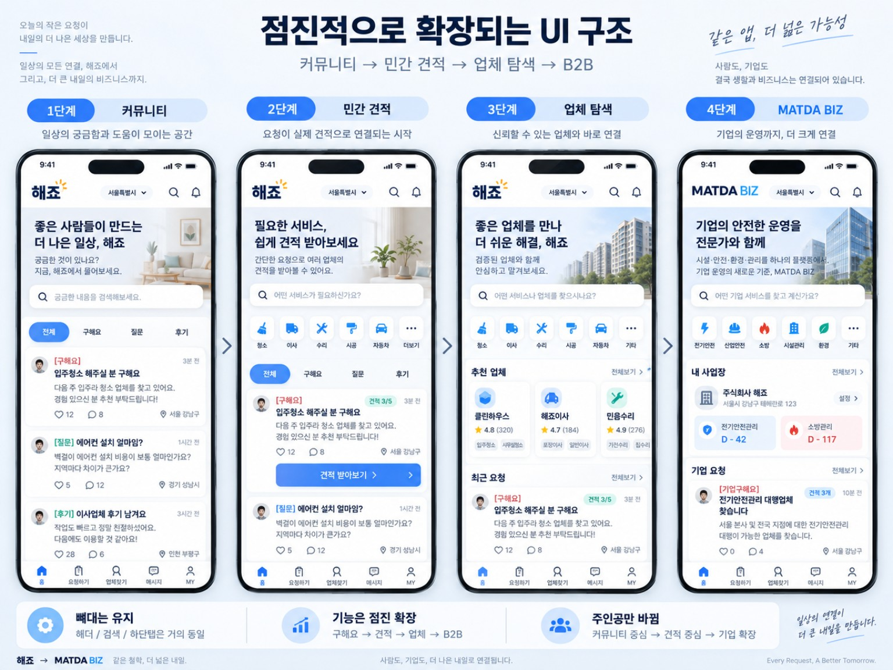

# 해죠 / MATDA BIZ — Codex GUI 최종 개발 패키지

> 목적: Codex GUI / Astra / 다른 AI 코딩 에이전트가 **이 폴더만 읽고도** 제품 철학, UI, 단계별 기능, DB, 테스트, 법적 경계, 결제·정산의 장기 확장까지 이해하고 개발을 이어갈 수 있게 하는 최종 통합 명세다.

## 1. 작업명과 브랜드 상태
현재 작업명은 아래와 같다. **아직 최종 상표/도메인 확정으로 간주하지 말 것.**

- 소비자/민간 영역: **해죠 (HAEJYO)**
- 기업 영역: **MATDA BIZ**
- 상위 브랜드/도메인 후보: **MATDA / matda.net**

코드에 브랜드 문자열을 하드코딩하지 말고 `siteConfig`, 환경설정 또는 CMS형 설정값으로 분리한다. 추후 해죠/MATDA 명칭이 바뀌어도 기능 코드와 URL 구조를 대규모 수정하지 않도록 한다.

## 2. 제품 한 줄 정의
**복잡한 설문 없이 커뮤니티에 글을 쓰듯 요청하면 사람·업체와 연결되고, 같은 글이 점진적으로 비교견적·업체탐색·기업 RFQ·민간입찰까지 확장되는 서비스.**

핵심 철학은 다음 한 문장이다.

> **“요청서를 작성하는 서비스가 아니라, 그냥 글을 쓰면 요청서가 되는 서비스.”**

## 3. 절대 바뀌면 안 되는 방향
1. **모바일 퍼스트.** 개인 사용자의 모바일 UX가 1순위다.
2. 초기에는 디시/당근처럼 가볍게 `글 → 댓글/채팅 → 연결`이 가능해야 한다.
3. 숨고처럼 긴 다단계 질문을 강제하지 않는다.
4. 커뮤니티는 나중에 없어지는 임시 기능이 아니다. 최종 서비스에서도 탐색·후기·SEO·신뢰의 층으로 유지한다.
5. 커뮤니티 → 민간견적 → 업체찾기 → B2B가 될 때 사이트를 갈아엎지 않는다.
6. **UI의 뼈대는 유지하고, 홈의 주인공과 기능의 노출 우선순위만 바꾼다.**
7. 커뮤니티 활성화가 약하더라도 **핵심 소프트웨어 로드맵 개발을 중단하지 않는다.** 최소한 B2C 견적·업체마켓·B2B 기본 매칭/RFQ까지는 연속 개발한다.
8. 실제 이용 데이터는 개발 중단 기준이 아니라 개선·우선순위 판단 자료로 기록한다.
9. 돈이 많이 드는 외부사업(직원 대량채용, 직접 대행업, 부지/충전 인프라)은 제품 개발과 별도로 검증 후 진행한다.
10. 모든 작업은 `BUILD_PROGRESS.md`를 기준으로 이어간다.

## 4. 문서 읽는 순서
Codex GUI/Astra는 작업 전 반드시 다음 순서로 읽는다.

1. `01_CODEX_GUI_MASTER_PROMPT.md`
2. `02_PRODUCT_VISION_AND_DECISIONS.md`
3. `03_PHASE_ROADMAP.md`
4. `04_DESIGN_SYSTEM_AND_REFERENCES.md`
5. `05_RESPONSIVE_MOBILE_PC_APP.md`
6. 현재 Phase에 해당하는 기능 문서
7. `12_DATA_MODEL_SECURITY.md`
8. `18_TESTING_RELEASE_GATES.md`
9. `20_AGENT_WORKFLOW.md`
10. `BUILD_PROGRESS.md`
11. `DECISIONS_LOG.md`

입찰/결제/법무 단계에서는 각각 관련 문서를 추가로 읽는다.

## 5. 문서 목록
- `01_CODEX_GUI_MASTER_PROMPT.md` — 에이전트에게 그대로 전달하는 전체 명령문
- `02_PRODUCT_VISION_AND_DECISIONS.md` — 제품 철학·고정 결정사항
- `03_PHASE_ROADMAP.md` — 단계별 개발 순서
- `04_DESIGN_SYSTEM_AND_REFERENCES.md` — 첨부 컨셉샷과 UI 기준
- `05_RESPONSIVE_MOBILE_PC_APP.md` — 모바일/PC/향후 앱 전략
- `06_PHASE1_COMMUNITY_MVP.md` — 초기 커뮤니티
- `07_PHASE2_CONSUMER_QUOTES.md` — 민간 견적
- `08_PHASE3_PROVIDER_MARKETPLACE.md` — 업체 프로필/탐색/MY
- `09_PHASE4_MATDA_BIZ.md` — 기업서비스 기본
- `10_B2B_RFQ_AND_TENDER.md` — 비교견적/RFQ/민간입찰
- `11_CATEGORIES_AND_TEMPLATES.md` — 카테고리·글/견적/입찰 템플릿
- `12_DATA_MODEL_SECURITY.md` — DB/RLS/파일보안
- `13_SEARCH_SEO_REGION.md` — 검색·지역·SEO
- `14_CHAT_NOTIFICATION_MEDIA.md` — 채팅/알림/이미지·첨부
- `15_PAYMENT_SETTLEMENT_ARCHITECTURE.md` — 결제/정산 장기설계
- `16_LEGAL_COMPLIANCE_CHECKLIST.md` — 법/인허가 경계
- `17_ADMIN_MODERATION_ANALYTICS.md` — 운영자/신고/지표
- `18_TESTING_RELEASE_GATES.md` — 테스트와 단계별 통과기준
- `19_INFRA_DEPLOYMENT_COST.md` — Supabase/Cloudflare/R2
- `20_AGENT_WORKFLOW.md` — Codex 작업방식/상태문서 갱신
- `21_ACCEPTANCE_TEST_MATRIX.md` — 최종 QA 체크리스트
- `BUILD_PROGRESS.md` — 실제 개발 진행상태
- `DECISIONS_LOG.md` — 요구사항 변경 기록
- `references/` — 기존 컨셉샷
- `prompts/` — 단계별 실행 프롬프트

## 6. 가장 중요한 디자인 참고 이미지

위 이미지는 **단계가 달라져도 같은 앱처럼 보이는 방식**을 이해하기 위한 1순위 참고자료다. 이미지 속 문구·브랜드·카테고리를 그대로 복제하는 것이 아니라 구조와 연속성을 참고한다.

## 7. 첫 실행
프로젝트가 아직 없다면 `prompts/00_BOOTSTRAP.md`부터 실행한다.
이미 코드가 있다면 **기존 코드를 삭제하거나 새 프로젝트를 만들기 전에** 구조를 먼저 검사하고 재사용 가능한 부분을 최대한 유지한다.
