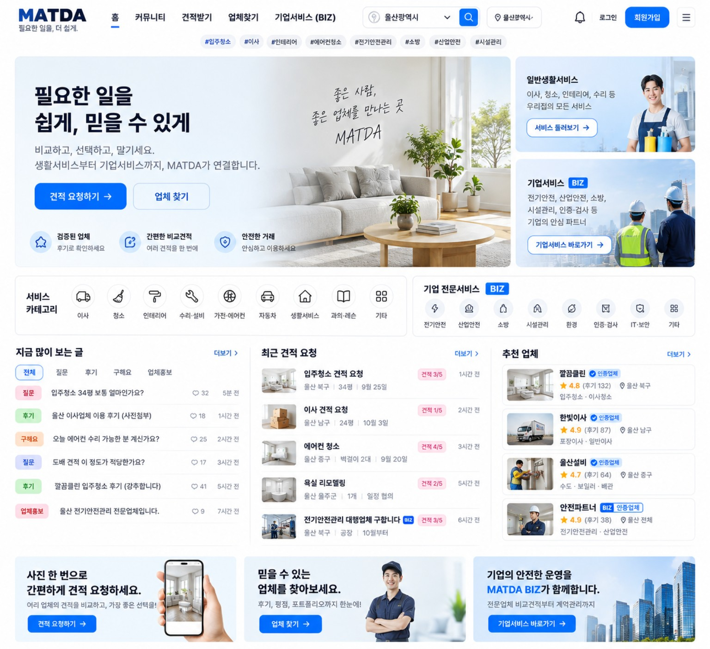
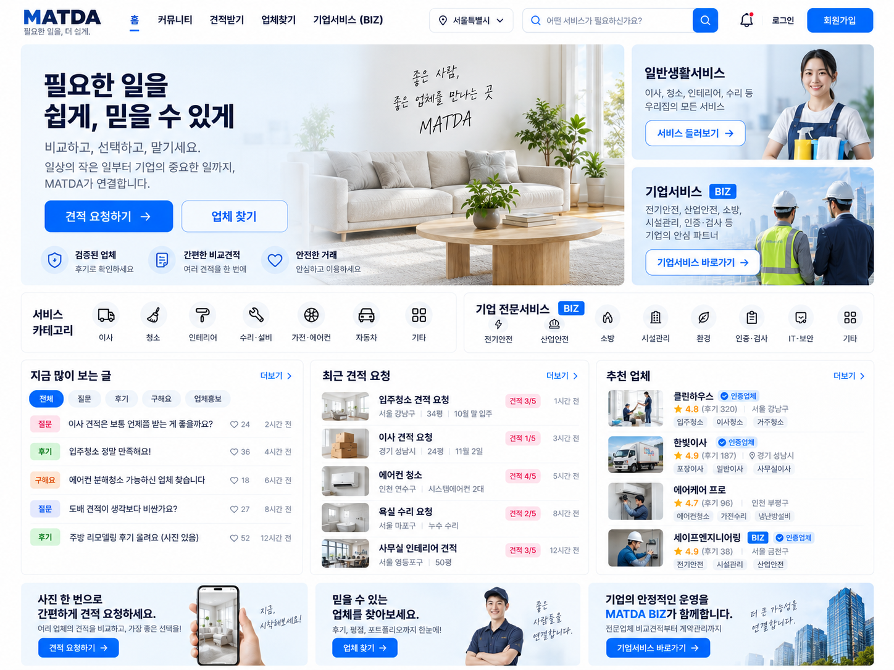
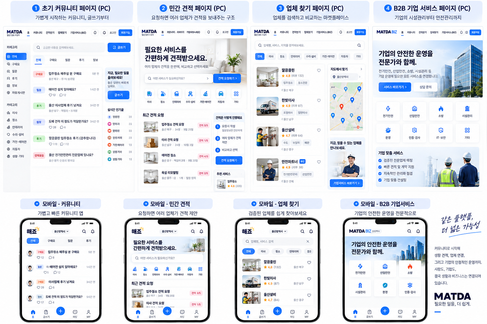
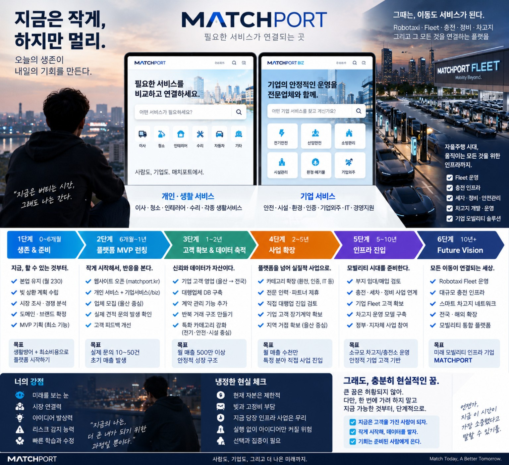

# 디자인 시스템 + 기존 컨셉샷 사용 규칙

## 1. 결론
**기존에 만든 컨셉샷을 실제 개발 레퍼런스로 사용한다.**
말로만 “심플하게” 지시하면 에이전트가 투박하거나 전형적인 SaaS 화면을 만들 수 있으므로, 이미지와 텍스트 명세를 항상 함께 본다.

## 2. 1순위 — 단계별 모바일 연속성

참고:
- 같은 상단/하단 뼈대
- 커뮤니티 → 견적 → 업체 → BIZ로 기능이 자연스럽게 승격
- 모바일 카드 크기와 정보밀도
- 검색/카테고리/피드의 비중 변화

복사 금지:
- 이미지 속 임시 브랜드/문구
- 실제 명세와 다른 카테고리 수
- 불필요하게 큰 히어로

## 3. PC 전체 컨셉

장기 PC 참고.
장점:
- 한 플랫폼에 소비자와 BIZ 진입점 공존
- 카테고리/피드/견적/업체의 시각적 관계
- 밝고 신뢰감 있는 톤

주의:
- 초기부터 전부 노출하지 않는다.
- 배너를 줄인다.
- 초기 커뮤니티에서는 피드가 먼저다.

## 4. PC 최종 완성형 참고

이 이미지는 **Phase 3~4 이후의 성숙한 PC 홈** 참고.
초기 MVP 레이아웃이 아니다.

참고:
- 헤더 높이
- 화이트/블루
- 카드 radius/border/shadow
- 콘텐츠 3열 정렬
- 최근 요청/추천업체 밀도

## 5. PC/Mobile 단계 매트릭스

기능별 PC/모바일 차이 참고.

## 6. 장기 비전 이미지

장기 사업 아이디어/브랜드 방향 참고용이며 MVP UI 구현 기준은 아니다.

---

# 디자인 토큰 권장
정확한 값은 실제 구현에서 조정 가능하지만 일관성을 유지한다.

- Background: white / near-white
- Text primary: deep navy
- Primary CTA: clean medium blue
- Muted: cool gray-blue
- Success: green
- Warning: amber
- Danger: red
- Border: very light cool gray
- Radius: 12~18px 중심
- Shadow: 매우 약하게
- Typography: 한국어 가독성 우선, 지나치게 작은 본문 금지

## 스타일 금지
- 과도한 glassmorphism
- 무거운 gradient 남발
- 큰 3D 아이콘 남발
- 포털처럼 배너 4~5개 연속
- 카드마다 서로 다른 스타일
- 모바일에서 작은 글씨로 정보 욱여넣기

## UI 변경 원칙
사용자가 별도 수정 요청하지 않으면:
- 컬러시스템 전면교체 X
- 헤더 구조 대폭변경 X
- 모바일 하단탭 대폭변경 X
- 카드 스타일 전면교체 X

새 기능을 기존 컴포넌트에 확장한다.
